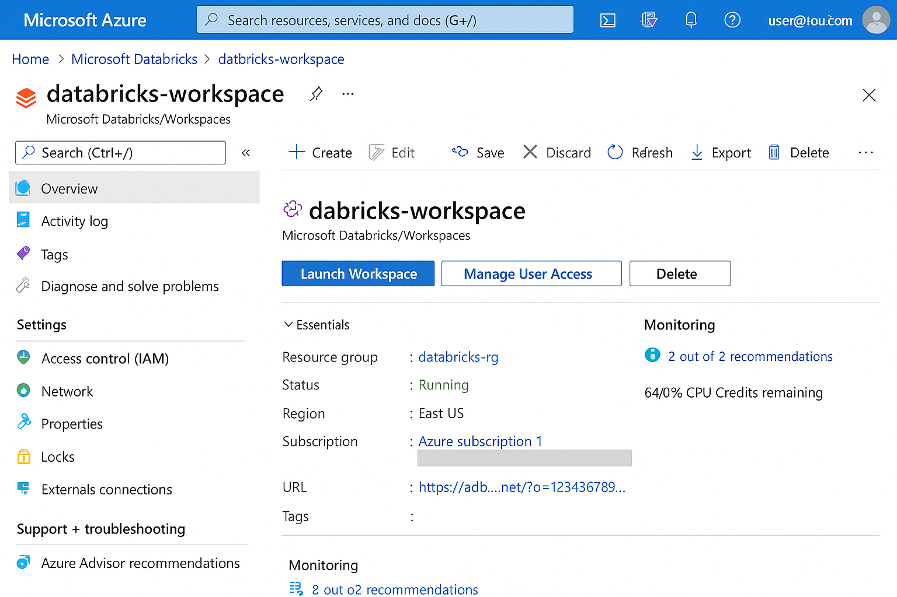

# Criando um Monitoramento de Custos no Data Factory
Este repositório foi criado como parte do desafio do módulo **Azure Databricks**, do curso **Microsoft AI for Tech** na [DIO.me](https://www.dio.me).

## 📌 Objetivo do Desafio

Criar este repositório para documentar o processo de uso do **Azure Databricks**, com prints, descrições, insights e aprendizados extraídos do conteúdo estudado.

---

## 🧭 Etapas Realizadas

### ✅ 1. Criação do Repositório

- Repositório criado com nome: `azure-databricks-dio`
- README iniciado com informações básicas do desafio

### ✅ 2. Acesso ao Azure e Criação do Workspace

- Criei um **Azure Databricks Workspace** via portal do Azure
- Configurei o resource group, região e plano de pricing gratuito (quando possível)

📷 *Print do workspace criado no Azure*  

### ✅ 3. Acesso ao Azure Databricks e Criação de Cluster

- Acessei o Databricks via botão "Launch Workspace"
- Criei um cluster com configuração padrão

📷 *Print do cluster criado*  

### ✅ 4. Criação de Notebook e Execução de Código

- Criei um notebook em Python
- Executei comandos simples com Spark (ex: leitura de DataFrame)

📷 *Print do notebook com código Spark*  

---

## 💡 Insights e Possibilidades que Aprendi

Durante o estudo do módulo, aprendi que:

- O **Azure Databricks** integra o poder do Apache Spark com a escalabilidade da nuvem Azure.
- A ideia de **Lakehouse** une Data Lake e Data Warehouse, permitindo consultas analíticas e operacionais com eficiência.
- É possível usar **Delta Lake** para garantir transações ACID e versionamento de dados, o que é essencial para pipelines confiáveis.
- O ambiente Databricks facilita a **colaboração entre cientistas de dados, engenheiros e analistas** por meio de workspaces e notebooks compartilhados.
- É uma plataforma muito poderosa para implementar **Machine Learning e IA escalável** com dados reais em ambientes corporativos.

---

## 🧠 Considerações Finais

O Azure Databricks é uma solução robusta para projetos de dados e inteligência artificial. Esse primeiro contato mostrou como é possível criar um ambiente de análise de dados escalável e colaborativo na nuvem, com suporte total a Spark e outras ferramentas modernas.

---

## 📁 Estrutura de Pastas
azure-databricks-dio/ ├── prints/ │ ├── workspace_azure.png │ ├── cluster_databricks.png │ └── notebook_codigo.png ├── README.md
